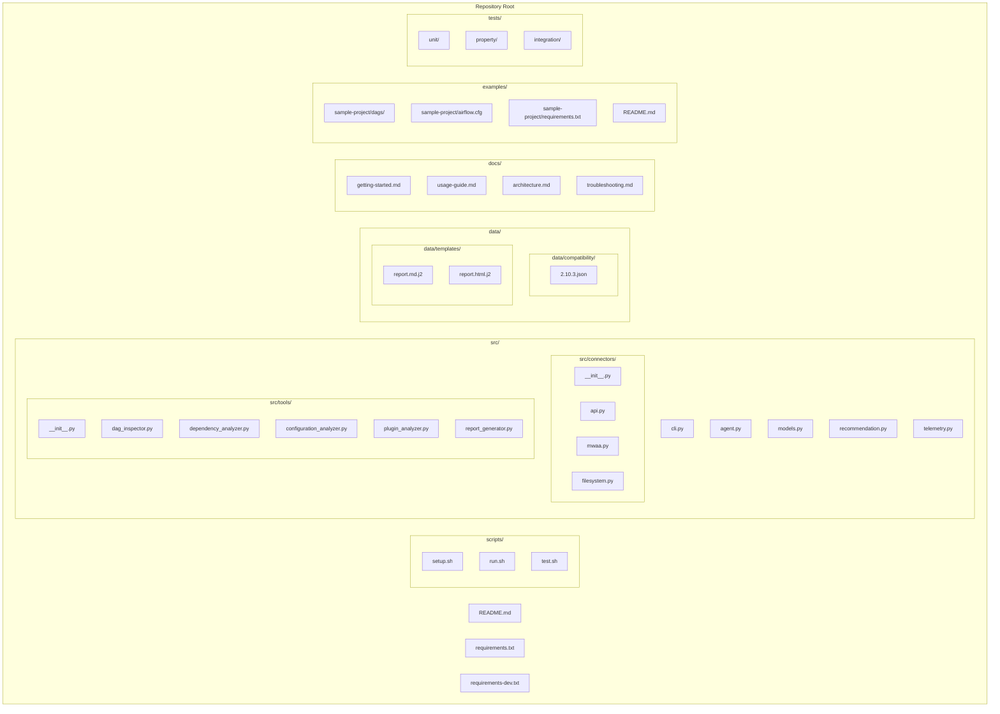
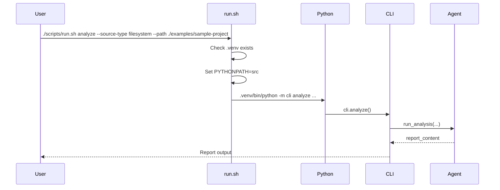

# Design Document: AWS Samples Restructure

## Overview

This design describes the restructuring of the MWAA Analyzer Agent from a pip-installable Python library (using `pyproject.toml` with setuptools) into an AWS samples-style repository. The restructured project will use shell scripts for setup and execution, a flat `src/` directory for source code, and a top-level `data/` directory for compatibility manifests and report templates.

The restructuring preserves all existing functionality — the same CLI, connectors, analysis tools, and report generation — while changing how the project is organized, installed, and invoked.

### Key Design Decisions

1. **Remove `pyproject.toml` entirely**: Rather than keeping a stripped-down pyproject.toml, remove it completely. The project is not a library and should not look like one. A `requirements.txt` and `requirements-dev.txt` replace the dependency declarations.

2. **Flat module layout under `src/`**: Source files move from `mwaa_analyzer_agent/` to `src/` without a top-level package namespace. Imports change from `from mwaa_analyzer_agent.models import X` to `from models import X`. This eliminates the need for `pip install -e .` and makes the PYTHONPATH approach straightforward.

3. **Repository-root-relative data paths**: The data loader and report generator will resolve paths relative to the repository root (determined at runtime) rather than relative to `__file__`. This decouples data file location from source code location.

4. **Shell scripts as the primary interface**: `scripts/setup.sh`, `scripts/run.sh`, and `scripts/test.sh` are the user-facing entry points. They handle virtualenv creation, PYTHONPATH configuration, and argument forwarding.

5. **Preserve test structure**: The `tests/` directory keeps its existing `unit/`, `property/`, and `integration/` subdirectories. Test imports are updated to match the new flat module layout.

## Architecture



### Execution Flow



## Components and Interfaces

### 1. Setup Script (`scripts/setup.sh`)

Creates the development environment from scratch.

```bash
#!/usr/bin/env bash
set -euo pipefail

REPO_ROOT="$(cd "$(dirname "${BASH_SOURCE[0]}")/.." && pwd)"
VENV_DIR="${REPO_ROOT}/.venv"

echo "Creating virtual environment..."
python3 -m venv "${VENV_DIR}"

echo "Installing dependencies..."
"${VENV_DIR}/bin/pip" install --upgrade pip
"${VENV_DIR}/bin/pip" install -r "${REPO_ROOT}/requirements.txt"

echo "Setup complete. Activate with: source .venv/bin/activate"
```

**Behavior:**
- Resolves repository root relative to script location
- Creates `.venv/` at repository root
- Installs from `requirements.txt`
- Idempotent — safe to re-run

### 2. Run Script (`scripts/run.sh`)

Invokes the analyzer CLI with proper environment configuration.

```bash
#!/usr/bin/env bash
set -euo pipefail

REPO_ROOT="$(cd "$(dirname "${BASH_SOURCE[0]}")/.." && pwd)"
VENV_DIR="${REPO_ROOT}/.venv"

if [ ! -d "${VENV_DIR}" ]; then
    echo "Error: Virtual environment not found at ${VENV_DIR}"
    echo "Please run 'scripts/setup.sh' first."
    exit 1
fi

export PYTHONPATH="${REPO_ROOT}/src:${PYTHONPATH:-}"
exec "${VENV_DIR}/bin/python" -m cli "$@"
```

**Behavior:**
- Checks for `.venv/` existence before proceeding
- Sets `PYTHONPATH` to include `src/`
- Forwards all arguments to the CLI module via `python -m cli`
- Uses `exec` to replace the shell process

### 3. Test Script (`scripts/test.sh`)

Runs the test suite with proper path configuration.

```bash
#!/usr/bin/env bash
set -euo pipefail

REPO_ROOT="$(cd "$(dirname "${BASH_SOURCE[0]}")/.." && pwd)"
VENV_DIR="${REPO_ROOT}/.venv"

if [ ! -d "${VENV_DIR}" ]; then
    echo "Error: Virtual environment not found. Running setup first..."
    "${REPO_ROOT}/scripts/setup.sh"
fi

# Install dev dependencies if pytest is not available
if ! "${VENV_DIR}/bin/python" -c "import pytest" 2>/dev/null; then
    echo "Installing development dependencies..."
    "${VENV_DIR}/bin/pip" install -r "${REPO_ROOT}/requirements-dev.txt"
fi

export PYTHONPATH="${REPO_ROOT}/src:${PYTHONPATH:-}"
exec "${VENV_DIR}/bin/python" -m pytest "$@"
```

**Behavior:**
- Auto-runs setup if `.venv/` is missing
- Installs dev dependencies on first test run
- Sets `PYTHONPATH` to include `src/`
- Forwards pytest arguments (e.g., `-k`, `--verbose`, test paths)

### 4. Source Directory (`src/`)

The source code moves from `mwaa_analyzer_agent/` to `src/` with the following changes:

| Current Path | New Path |
|---|---|
| `mwaa_analyzer_agent/__init__.py` | Removed (no package namespace) |
| `mwaa_analyzer_agent/cli.py` | `src/cli.py` |
| `mwaa_analyzer_agent/agent.py` | `src/agent.py` |
| `mwaa_analyzer_agent/models.py` | `src/models.py` |
| `mwaa_analyzer_agent/recommendation.py` | `src/recommendation.py` |
| `mwaa_analyzer_agent/telemetry.py` | `src/telemetry.py` |
| `mwaa_analyzer_agent/connectors/` | `src/connectors/` |
| `mwaa_analyzer_agent/tools/` | `src/tools/` |
| `mwaa_analyzer_agent/data/` | `data/compatibility/` (JSON files only) |
| `mwaa_analyzer_agent/data/loader.py` | `src/data_loader.py` |
| `mwaa_analyzer_agent/templates/` | `data/templates/` |

**Import changes:**
- All `from mwaa_analyzer_agent.X import Y` become `from X import Y`
- All `from mwaa_analyzer_agent.connectors.X import Y` become `from connectors.X import Y`
- All `from mwaa_analyzer_agent.tools.X import Y` become `from tools.X import Y`
- `from mwaa_analyzer_agent.data.loader import load_manifest` becomes `from data_loader import load_manifest`

### 5. Data Loader (`src/data_loader.py`)

Updated to resolve paths relative to repository root:

```python
"""Loader for MWAA version manifest data files."""

from __future__ import annotations

import json
import os
from pathlib import Path

from models import MWAAVersionManifest

def _get_repo_root() -> Path:
    """Determine the repository root directory.
    
    Uses the REPO_ROOT environment variable if set (for flexibility),
    otherwise walks up from this file's location to find the directory
    containing the 'data' folder.
    """
    env_root = os.environ.get("REPO_ROOT")
    if env_root:
        return Path(env_root)
    
    # Walk up from src/data_loader.py -> src/ -> repo_root/
    return Path(__file__).resolve().parent.parent

_DATA_DIR = _get_repo_root() / "data" / "compatibility"


def load_manifest(version: str) -> MWAAVersionManifest:
    """Load the MWAA version manifest for the given Airflow version."""
    manifest_path = _DATA_DIR / f"{version}.json"
    if not manifest_path.exists():
        available = sorted(p.stem for p in _DATA_DIR.glob("*.json"))
        raise ValueError(
            f"Unsupported MWAA version: {version}. "
            f"Available versions: {', '.join(available) if available else 'none'}"
        )

    with open(manifest_path, encoding="utf-8") as f:
        data = json.load(f)

    return MWAAVersionManifest(
        airflow_version=data["airflow_version"],
        pre_installed_packages=data["pre_installed_packages"],
        supported_config_keys=set(data["supported_config_keys"]),
        supported_operators=set(data["supported_operators"]),
        known_incompatible_packages=set(data["known_incompatible_packages"]),
    )
```

### 6. Report Generator Template Resolution

The report generator's `_TEMPLATE_DIR` changes from a `__file__`-relative path to a repository-root-relative path:

```python
# Old: _TEMPLATE_DIR = Path(__file__).resolve().parent.parent / "templates"
# New:
def _get_template_dir() -> Path:
    """Resolve the template directory relative to repository root."""
    env_root = os.environ.get("REPO_ROOT")
    if env_root:
        return Path(env_root) / "data" / "templates"
    return Path(__file__).resolve().parent.parent / "data" / "templates"

_TEMPLATE_DIR = _get_template_dir()
```

### 7. CLI Module (`src/cli.py`)

The CLI module adds a `__main__` block to support `python -m cli` invocation:

```python
# At the end of cli.py
if __name__ == "__main__":
    cli()
```

This is the entry point used by `scripts/run.sh`.

### 8. Requirements Files

**`requirements.txt`** (runtime dependencies):
```
strands-agents>=0.1
strands-agents-builder>=0.1
click>=8.1
httpx>=0.27
boto3>=1.34
packaging>=24.0
jinja2>=3.1
```

**`requirements-dev.txt`** (development/testing dependencies):
```
-r requirements.txt
hypothesis>=6.100
pytest>=8.0
pytest-mock>=3.12
moto>=5.0
```

### 9. Documentation Directory (`docs/`)

| File | Purpose |
|---|---|
| `getting-started.md` | Prerequisites (Python 3.11+, AWS credentials), setup instructions, first analysis run |
| `usage-guide.md` | All CLI options, source type details, output format examples, environment variables |
| `architecture.md` | System design, component diagram, data flow, extension points |
| `troubleshooting.md` | Common errors (import failures, credential issues, connectivity), FAQ |

### 10. Examples Directory (`examples/`)

```
examples/
├── README.md
└── sample-project/
    ├── dags/
    │   ├── example_dag.py
    │   └── complex_dag.py
    ├── plugins/
    │   └── custom_operator.py
    ├── requirements.txt
    └── airflow.cfg
```

The sample project provides a self-contained filesystem source that users can analyze immediately after setup:

```bash
./scripts/run.sh analyze --source-type filesystem --path ./examples/sample-project
```

## Data Models

No changes to the data model definitions. All dataclasses, enums, and type definitions in `models.py` remain identical. The only change is the import path (from `mwaa_analyzer_agent.models` to `models`).

### File Mapping Summary

| Category | Current Location | New Location |
|---|---|---|
| Source code | `mwaa_analyzer_agent/*.py` | `src/*.py` |
| Connectors | `mwaa_analyzer_agent/connectors/` | `src/connectors/` |
| Tools | `mwaa_analyzer_agent/tools/` | `src/tools/` |
| Data loader | `mwaa_analyzer_agent/data/loader.py` | `src/data_loader.py` |
| Compatibility JSON | `mwaa_analyzer_agent/data/*.json` | `data/compatibility/*.json` |
| Report templates | `mwaa_analyzer_agent/templates/*.j2` | `data/templates/*.j2` |
| Tests | `tests/` | `tests/` (unchanged) |
| Package config | `pyproject.toml` | Removed |
| Dependencies | `pyproject.toml [dependencies]` | `requirements.txt` |
| Dev dependencies | `pyproject.toml [optional-dependencies.dev]` | `requirements-dev.txt` |

## Error Handling

### Script Error Handling

| Scenario | Script | Behavior |
|---|---|---|
| Python not installed | `setup.sh` | Fails with `python3: command not found` (shell error) |
| `.venv` missing | `run.sh` | Prints error message directing user to run `setup.sh`, exits 1 |
| `.venv` missing | `test.sh` | Auto-runs `setup.sh` before proceeding |
| Dev deps missing | `test.sh` | Auto-installs from `requirements-dev.txt` |
| Invalid CLI args | `run.sh` | CLI prints usage error (unchanged behavior) |
| Import error | Any | Python raises `ModuleNotFoundError` with clear traceback pointing to PYTHONPATH |

### Import Error Guidance

If a user runs `python src/cli.py` directly without setting PYTHONPATH, they'll get an `ImportError`. The `cli.py` module includes a guard:

```python
try:
    from models import SourceType, TelemetryEvent
except ImportError as e:
    import sys
    print(
        "Error: Could not import required modules. "
        "Please use 'scripts/run.sh' to run the analyzer, "
        "or set PYTHONPATH to include the 'src/' directory.",
        file=sys.stderr,
    )
    sys.exit(1)
```

### Data File Resolution Errors

If the `data/` directory cannot be found (e.g., running from a different working directory without REPO_ROOT set), the data loader raises a `ValueError` with a message explaining the expected directory structure.

## Testing Strategy

### Why Property-Based Testing Does Not Apply

This feature is a repository restructuring — it moves files, updates import paths, creates shell scripts, and reorganizes directories. There is no new business logic with varying inputs. The acceptance criteria are about:
- File and directory existence (SMOKE tests)
- Script execution behavior (INTEGRATION tests)
- Specific content checks (EXAMPLE tests)

There are no universal properties of the form "for all inputs X, property P(X) holds" that would benefit from 100+ iterations of random input generation. The existing property-based tests for the analyzer logic remain unchanged and continue to validate the core business logic.

### Test Approach

**Smoke tests** (file structure validation):
- Verify all expected files and directories exist in the restructured layout
- Verify `pyproject.toml` is removed
- Verify `requirements.txt` and `requirements-dev.txt` contain expected packages
- Verify scripts are executable

**Example-based unit tests** (import and path resolution):
- Verify modules are importable with `PYTHONPATH=src`
- Verify data loader resolves to `data/compatibility/`
- Verify report generator resolves to `data/templates/`
- Verify all public function signatures are preserved
- Verify `README.md` links to docs/ files
- Verify `CONTRIBUTING.md` references the scripts workflow

**Integration tests** (end-to-end script behavior):
- Execute `scripts/setup.sh` and verify `.venv/` creation
- Execute `scripts/run.sh --help` and verify CLI output
- Execute `scripts/run.sh analyze --source-type filesystem --path ./examples/sample-project` and verify report generation
- Execute `scripts/test.sh` and verify tests pass
- Verify `run.sh` error message when `.venv/` is missing

**Regression tests** (functionality preservation):
- Run the existing unit test suite against the restructured code
- Run the existing property test suite against the restructured code
- Verify all three source types work
- Verify all three output formats work

### Test Configuration

The `scripts/test.sh` script replaces the `[tool.pytest.ini_options]` from `pyproject.toml`. A `pytest.ini` or `pyproject.toml` (without build-system) at the repo root provides pytest configuration:

```ini
# pytest.ini
[pytest]
testpaths = tests
markers =
    unit: Unit tests
    property: Property-based tests
    integration: Integration tests
```

### Test Import Updates

All test files update their imports from:
```python
from mwaa_analyzer_agent.models import CompatibilityFinding
```
to:
```python
from models import CompatibilityFinding
```

The `conftest.py` at the test root may add `src/` to `sys.path` as a fallback for IDE support:
```python
import sys
from pathlib import Path

sys.path.insert(0, str(Path(__file__).parent.parent / "src"))
```
