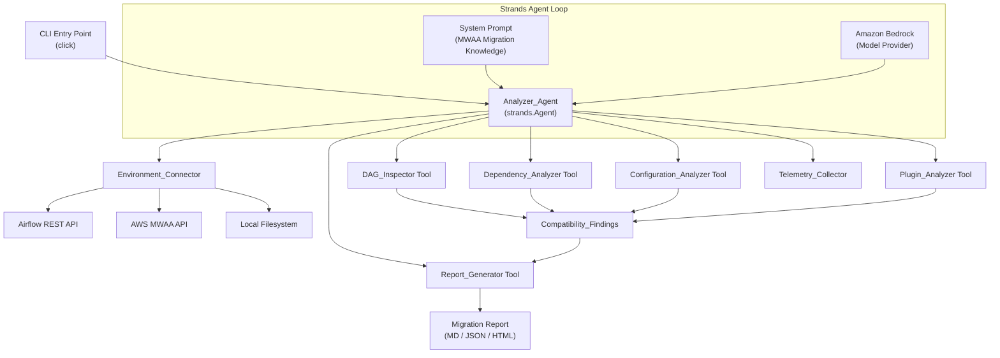
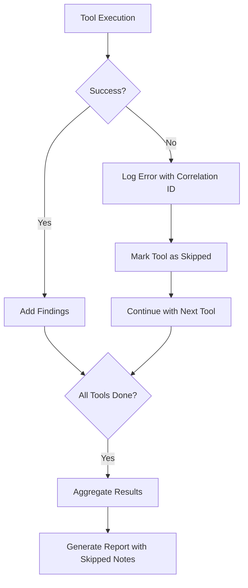

# Design Document: MWAA Analyzer Agent

## Overview

The MWAA Analyzer Agent is a Python CLI tool that analyzes Apache Airflow environments and produces migration recommendation reports for Amazon MWAA. The tool is built on the [Strands Agents SDK](https://strandsagents.com/) with Amazon Bedrock as the default model provider.

The architecture follows a tool-based agent pattern: the `Analyzer_Agent` is a Strands `Agent` instance configured with a system prompt encoding MWAA migration knowledge. Each analysis capability (DAG inspection, dependency analysis, configuration analysis, plugin analysis, report generation) is implemented as a `@tool`-decorated Python function. The agent's built-in reasoning loop orchestrates tool invocation, aggregates findings, and produces a final migration recommendation.

The system supports three source types (Airflow REST API, MWAA environment, local filesystem) and three output formats (Markdown, JSON, HTML). A telemetry subsystem collects anonymous usage statistics with opt-out support.

### Key Design Decisions

1. **Strands `@tool` decorator pattern**: Each analyzer is a standalone `@tool` function rather than a class hierarchy. This aligns with the Strands SDK's model-driven approach where the LLM decides tool invocation order.
2. **Data-class-based findings model**: All analyzers produce `Compatibility_Finding` dataclass instances, providing a uniform interface for aggregation and report generation.
3. **Fail-open partial analysis**: If one analyzer fails, the agent continues with remaining tools and includes partial results. This is handled by per-tool error boundaries.
4. **Stateless credential handling**: Credentials are held in memory only for the duration of the analysis run and cleared on completion.

## Architecture



### Data Flow

1. The user invokes `mwaa-analyzer analyze` with source type and credentials.
2. The CLI parses arguments, initializes the `Environment_Connector`, and retrieves environment data.
3. The `Analyzer_Agent` receives the environment data and invokes analysis tools via the Strands agent loop.
4. Each tool produces a list of `Compatibility_Finding` objects.
5. The agent aggregates findings, determines the `Migration_Recommendation`, and invokes the `Report_Generator`.
6. The report is written to stdout or a file. Telemetry is sent asynchronously.

## Components and Interfaces

### 1. CLI Module (`mwaa_analyzer_agent/cli.py`)

Entry point using the `click` library. Provides the `mwaa-analyzer` command group with the `analyze` subcommand.

```python
@click.group()
def cli():
    """MWAA Analyzer Agent - AI-powered Airflow migration analysis."""
    pass

@cli.command()
@click.option("--source-type", type=click.Choice(["api", "mwaa", "filesystem"]), required=True)
@click.option("--endpoint", default=None, help="Airflow REST API endpoint URL")
@click.option("--token", default=None, help="Airflow REST API auth token")
@click.option("--environment-name", default=None, help="MWAA environment name")
@click.option("--region", default=None, help="AWS region for MWAA")
@click.option("--path", default=None, type=click.Path(exists=True), help="Local filesystem path")
@click.option("--output-format", type=click.Choice(["markdown", "json", "html"]), default="markdown")
@click.option("--output-file", default=None, type=click.Path(), help="Output file path")
@click.option("--target-mwaa-version", default="2.10.3", help="Target MWAA Airflow version")
@click.option("--verbose", is_flag=True, default=False, help="Enable debug logging")
def analyze(source_type, endpoint, token, environment_name, region, path,
            output_format, output_file, target_mwaa_version, verbose):
    """Analyze an Airflow environment for MWAA migration."""
    pass
```

**Validation rules:**
- `api` requires `--endpoint` and `--token`
- `mwaa` requires `--environment-name` and `--region`
- `filesystem` requires `--path`

### 2. Environment Connector (`mwaa_analyzer_agent/connectors/`)

Retrieves environment data from one of three source types. Each connector implements the `EnvironmentConnector` protocol.

```python
from typing import Protocol

class EnvironmentConnector(Protocol):
    def connect(self) -> None: ...
    def get_dags(self) -> list[DAGFile]: ...
    def get_requirements(self) -> str | None: ...
    def get_configuration(self) -> dict[str, dict[str, str]]: ...
    def get_plugins(self) -> list[PluginFile]: ...
    def get_metadata(self) -> EnvironmentMetadata: ...
```

**Implementations:**
- `ApiConnector`: Uses `httpx` to call Airflow REST API (v2/v3). Authenticates with bearer token. 30-second timeout.
- `MwaaConnector`: Uses `boto3` to call `mwaa:GetEnvironment`, then uses the MWAA CLI token to access the Airflow REST API.
- `FilesystemConnector`: Reads files from a local directory structure (`dags/`, `plugins/`, `requirements.txt`, `airflow.cfg`).

### 3. DAG Inspector Tool (`mwaa_analyzer_agent/tools/dag_inspector.py`)

```python
@tool
def inspect_dags(dag_files: list[dict]) -> dict:
    """Analyze DAG files for MWAA compatibility.
    
    Args:
        dag_files: List of DAG file dicts with 'filename' and 'content' keys.
    
    Returns:
        A dict with 'findings' containing compatibility results per DAG.
    """
```

**Analysis checks:**
- Operator/hook/sensor imports against MWAA-supported provider packages
- Direct metadata DB access (SQLAlchemy session usage)
- SubDAG usage (recommend TaskGroups)
- Local filesystem path usage for inter-task data exchange
- Custom operator dependencies on local system resources

Uses Python AST parsing (`ast` module) to inspect imports, function calls, and string literals in DAG files.

### 4. Dependency Analyzer Tool (`mwaa_analyzer_agent/tools/dependency_analyzer.py`)

```python
@tool
def analyze_dependencies(requirements_content: str, target_mwaa_version: str) -> dict:
    """Analyze Python dependencies for MWAA compatibility.
    
    Args:
        requirements_content: Raw content of requirements.txt.
        target_mwaa_version: Target MWAA Airflow version (e.g., "2.10.3").
    
    Returns:
        A dict with 'findings' containing compatibility results per dependency.
    """
```

**Analysis checks:**
- Parse requirements using `packaging.requirements.Requirement`
- Compare against a bundled MWAA package manifest (per version)
- Detect system-level library dependencies (known C-extension packages)
- Detect version conflicts with MWAA-provided packages

### 5. Configuration Analyzer Tool (`mwaa_analyzer_agent/tools/configuration_analyzer.py`)

```python
@tool
def analyze_configuration(config_entries: dict, target_mwaa_version: str) -> dict:
    """Analyze Airflow configuration for MWAA compatibility.
    
    Args:
        config_entries: Dict of {section: {key: value}} configuration entries.
        target_mwaa_version: Target MWAA Airflow version.
    
    Returns:
        A dict with 'findings' containing compatibility results per config entry.
    """
```

**Analysis checks:**
- Check each config key against MWAA-supported configuration options
- Flag unsupported sections (e.g., `[webserver]` settings managed by MWAA)
- Detect local filesystem path references in values
- Validate value ranges where applicable

### 6. Plugin Analyzer Tool (`mwaa_analyzer_agent/tools/plugin_analyzer.py`)

```python
@tool
def analyze_plugins(plugin_files: list[dict]) -> dict:
    """Analyze Airflow plugins for MWAA compatibility.
    
    Args:
        plugin_files: List of plugin file dicts with 'filename' and 'content' keys.
    
    Returns:
        A dict with 'findings' containing compatibility results per plugin.
    """
```

**Analysis checks:**
- Parse imports using AST to detect unavailable packages
- Detect subprocess calls, local file I/O outside DAGs folder, network socket usage
- Check for MWAA plugin structure compliance

### 7. Report Generator Tool (`mwaa_analyzer_agent/tools/report_generator.py`)

```python
@tool
def generate_report(findings: list[dict], recommendation: str,
                    output_format: str, metadata: dict) -> dict:
    """Generate the migration assessment report.
    
    Args:
        findings: All compatibility findings from analysis tools.
        recommendation: Migration recommendation (lift_and_shift, lift_and_modernize, not_possible).
        output_format: Output format (markdown, json, html).
        metadata: Report metadata (timestamp, source type, target version, tool version).
    
    Returns:
        A dict with 'report_content' containing the formatted report string.
    """
```

**Report sections:**
- Executive Summary
- Migration Recommendation
- Detailed Findings (by category: DAGs, Dependencies, Configuration, Plugins)
- Action Items (prioritized by effort for `lift_and_modernize`)
- Blockers and Workarounds (for `not_possible`)
- Metadata

**Format implementations:**
- Markdown: Jinja2 template rendering
- JSON: Structured dict serialization
- HTML: Jinja2 HTML template with inline CSS

### 8. Telemetry Collector (`mwaa_analyzer_agent/telemetry.py`)

```python
class TelemetryCollector:
    def __init__(self, endpoint: str, enabled: bool = True):
        self.endpoint = endpoint
        self.enabled = enabled
    
    def record_event(self, event: TelemetryEvent) -> None: ...
    def flush(self) -> None: ...
```

- Checks `MWAA_ANALYZER_TELEMETRY_OPT_OUT` environment variable
- Sends events via HTTPS POST using `httpx`
- Silently discards on network failure
- Displays first-run notice using a `.mwaa-analyzer-telemetry-notice` marker file in user home

### 9. Analyzer Agent (`mwaa_analyzer_agent/agent.py`)

```python
from strands import Agent
from strands.models.bedrock import BedrockModel

def create_agent(model_provider=None) -> Agent:
    model = model_provider or BedrockModel(
        model_id="us.anthropic.claude-sonnet-4-20250514",
        region_name="us-east-1",
    )
    return Agent(
        model=model,
        system_prompt=MWAA_MIGRATION_SYSTEM_PROMPT,
        tools=[inspect_dags, analyze_dependencies, 
               analyze_configuration, analyze_plugins, 
               generate_report],
    )
```

The system prompt encodes:
- MWAA compatibility rules and known limitations
- The three-outcome decision framework
- Instructions for aggregating findings and producing recommendations
- Report structure guidelines

### 10. Recommendation Engine (`mwaa_analyzer_agent/recommendation.py`)

Deterministic logic for deriving the migration recommendation from findings:

```python
def determine_recommendation(findings: list[CompatibilityFinding]) -> MigrationRecommendation:
    statuses = [f.status for f in findings]
    if any(s == CompatibilityStatus.INCOMPATIBLE for s in statuses):
        return MigrationRecommendation.NOT_POSSIBLE
    if any(s in (CompatibilityStatus.REQUIRES_MODIFICATION, CompatibilityStatus.VERSION_CONFLICT,
                 CompatibilityStatus.UNSUPPORTED) for s in statuses):
        return MigrationRecommendation.LIFT_AND_MODERNIZE
    return MigrationRecommendation.LIFT_AND_SHIFT
```

## Data Models

### Core Data Classes

```python
from dataclasses import dataclass, field
from enum import Enum
from datetime import datetime

class SourceType(Enum):
    API = "api"
    MWAA = "mwaa"
    FILESYSTEM = "filesystem"

class CompatibilityStatus(Enum):
    COMPATIBLE = "compatible"
    REQUIRES_MODIFICATION = "requires_modification"
    INCOMPATIBLE = "incompatible"
    VERSION_CONFLICT = "version_conflict"
    UNSUPPORTED = "unsupported"
    UNAVAILABLE = "unavailable"

class MigrationRecommendation(Enum):
    LIFT_AND_SHIFT = "lift_and_shift"
    LIFT_AND_MODERNIZE = "lift_and_modernize"
    NOT_POSSIBLE = "not_possible"

class FindingCategory(Enum):
    DAG = "dag"
    DEPENDENCY = "dependency"
    CONFIGURATION = "configuration"
    PLUGIN = "plugin"

class EffortLevel(Enum):
    LOW = "low"
    MEDIUM = "medium"
    HIGH = "high"

@dataclass
class CompatibilityFinding:
    category: FindingCategory
    identifier: str  # DAG name, package name, config key, plugin name
    status: CompatibilityStatus
    issues: list[str] = field(default_factory=list)
    recommendations: list[str] = field(default_factory=list)
    effort: EffortLevel | None = None

@dataclass
class DAGFile:
    filename: str
    content: str

@dataclass
class PluginFile:
    filename: str
    content: str

@dataclass
class EnvironmentMetadata:
    airflow_version: str | None = None
    source_type: SourceType = SourceType.FILESYSTEM
    dag_count: int = 0
    plugin_count: int = 0
    has_requirements: bool = False
    has_configuration: bool = False

@dataclass
class EnvironmentData:
    dags: list[DAGFile] = field(default_factory=list)
    requirements_content: str | None = None
    configuration: dict[str, dict[str, str]] = field(default_factory=dict)
    plugins: list[PluginFile] = field(default_factory=list)
    metadata: EnvironmentMetadata = field(default_factory=EnvironmentMetadata)

@dataclass
class ReportMetadata:
    timestamp: datetime
    source_type: SourceType
    target_mwaa_version: str
    tool_version: str
    run_id: str

@dataclass
class MigrationReport:
    metadata: ReportMetadata
    recommendation: MigrationRecommendation
    findings: list[CompatibilityFinding]
    executive_summary: str
    action_items: list[str] = field(default_factory=list)
    blockers: list[str] = field(default_factory=list)
    workarounds: list[str] = field(default_factory=list)

@dataclass
class TelemetryEvent:
    event_type: str
    source_type: str
    recommendation: str | None = None
    dag_count: int = 0
    duration_seconds: float = 0.0
    error_category: str | None = None
```

### MWAA Compatibility Data

The tool bundles static compatibility data per MWAA version:

```python
@dataclass
class MWAAVersionManifest:
    airflow_version: str
    pre_installed_packages: dict[str, str]  # package_name -> version
    supported_config_keys: set[str]         # "section.key" format
    supported_operators: set[str]           # fully qualified operator class names
    known_incompatible_packages: set[str]   # packages requiring system libs
```

These manifests are stored as JSON files in `mwaa_analyzer_agent/data/` and loaded at runtime based on the `--target-mwaa-version` flag.


## Correctness Properties

*A property is a characteristic or behavior that should hold true across all valid executions of a system — essentially, a formal statement about what the system should do. Properties serve as the bridge between human-readable specifications and machine-verifiable correctness guarantees.*

### Property 1: DAG import extraction completeness

*For any* valid Python source file containing known operator, hook, or sensor imports, the DAG_Inspector's import extraction function SHALL return a set that includes every operator, hook, and sensor import present in the source.

**Validates: Requirements 2.1**

### Property 2: Unsupported operator flagging

*For any* operator name and a given MWAA version manifest, if the operator is not in the manifest's supported operators set, the DAG_Inspector SHALL produce a finding with a non-compatible status for that operator; if the operator is in the supported set, the finding status SHALL be compatible.

**Validates: Requirements 2.2**

### Property 3: DAG incompatible pattern detection

*For any* DAG source containing one or more known incompatible patterns (direct metadata DB access via SQLAlchemy, SubDagOperator usage, or local filesystem paths for inter-task data exchange), the DAG_Inspector SHALL flag the DAG as requiring modernization and include the specific pattern type in the issues list.

**Validates: Requirements 2.3, 2.4, 2.5**

### Property 4: Compatibility finding structural invariant

*For any* input to any analyzer tool (DAG_Inspector, Dependency_Analyzer, Configuration_Analyzer, or Plugin_Analyzer), every produced Compatibility_Finding SHALL contain a non-empty identifier, a valid CompatibilityStatus enum value, and an issues list (which may be empty for compatible findings).

**Validates: Requirements 2.6, 3.5, 4.4, 5.4**

### Property 5: Requirements.txt parsing round-trip

*For any* valid requirements.txt entry string containing a package name and version constraint, parsing the entry and then formatting it back SHALL produce a string that, when parsed again, yields the same package name and version constraint.

**Validates: Requirements 3.1**

### Property 6: Dependency compatibility classification

*For any* dependency with a package name and version constraint, given a MWAA version manifest, the Dependency_Analyzer SHALL classify it as: compatible (if the package is pre-installed and the version satisfies the constraint), version_conflict (if the package is pre-installed but the version does not satisfy the constraint), unavailable (if the package is not pre-installed and not in the known-incompatible set), or incompatible (if the package requires system-level libraries from the known-incompatible set).

**Validates: Requirements 3.2, 3.3, 3.4**

### Property 7: Configuration key compatibility check

*For any* Airflow configuration key (in "section.key" format) and a given MWAA version manifest, if the key is not in the manifest's supported config keys set, the Configuration_Analyzer SHALL flag it as unsupported; if the key is in the supported set, it SHALL be flagged as supported (unless the value triggers a separate issue).

**Validates: Requirements 4.2**

### Property 8: Filesystem path detection in configuration values

*For any* configuration value string containing a Unix or Windows filesystem path pattern (e.g., starting with `/`, `./`, `../`, or a drive letter), the Configuration_Analyzer SHALL flag the entry as requiring modification.

**Validates: Requirements 4.3**

### Property 9: Plugin system resource access detection

*For any* Python source file containing calls to `subprocess.run`, `subprocess.Popen`, `os.system`, `open()` with paths outside the DAGs folder, or `socket` operations, the Plugin_Analyzer SHALL flag the plugin as requiring modernization and list the specific system resource access patterns found.

**Validates: Requirements 5.3**

### Property 10: Plugin unavailable import detection

*For any* plugin source file containing import statements for packages not available in the MWAA runtime (as defined by the version manifest), the Plugin_Analyzer SHALL flag the plugin as requiring modification and list all missing imports.

**Validates: Requirements 5.2**

### Property 11: Migration recommendation determinism

*For any* list of Compatibility_Findings, the recommendation engine SHALL produce: `Lift_and_Shift` if all findings have compatible status; `Not_Possible` if any finding has incompatible status; `Lift_and_Modernize` if at least one finding has requires_modification, version_conflict, or unsupported status and none have incompatible status.

**Validates: Requirements 6.2, 6.3, 6.4**

### Property 12: Report required sections presence

*For any* set of findings, recommendation, and metadata, the generated report (in any format) SHALL contain an executive summary section, the migration recommendation, a findings section organized by category (DAGs, dependencies, configuration, plugins), an action items section, and a metadata section with timestamp, source type, target MWAA version, and tool version.

**Validates: Requirements 7.1, 7.7**

### Property 13: JSON report validity

*For any* set of findings and recommendation, when the output format is JSON, the generated report SHALL be valid JSON that deserializes to a dictionary containing keys for all required report sections.

**Validates: Requirements 7.3**

### Property 14: HTML report self-containment

*For any* set of findings and recommendation, when the output format is HTML, the generated report SHALL contain `<html>`, `<head>`, `<body>` tags and at least one `<style>` block with inline CSS.

**Validates: Requirements 7.4**

### Property 15: Lift_and_Modernize effort ordering

*For any* set of findings where the recommendation is Lift_and_Modernize, the report's action items section SHALL list modifications in non-decreasing order of effort level (low before medium before high).

**Validates: Requirements 7.5**

### Property 16: Not_Possible blockers inclusion

*For any* set of findings where the recommendation is Not_Possible, the report SHALL include a blockers section listing every finding with incompatible status.

**Validates: Requirements 7.6**

### Property 17: Telemetry event completeness

*For any* completed analysis run, the telemetry event SHALL contain all required fields: event_type, source_type, recommendation, dag_count, duration_seconds, and error_category (which may be null).

**Validates: Requirements 9.1**

### Property 18: No PII in telemetry

*For any* analysis run where the environment data contains credentials, endpoint URLs, environment names, DAG content, or IP addresses, the telemetry event SHALL not contain any of these values.

**Validates: Requirements 9.2**

### Property 19: No credentials in output artifacts

*For any* analysis run where credentials (tokens, passwords, AWS keys) are provided, the generated report content, log output, and telemetry events SHALL not contain any credential values.

**Validates: Requirements 11.1**

### Property 20: CLI invalid flag combination error

*For any* invocation of the CLI where required flags for the chosen source type are missing (e.g., `--source-type api` without `--endpoint`), the CLI SHALL exit with a non-zero status code and display an error message identifying the missing flags.

**Validates: Requirements 10.8**

### Property 21: Partial results on tool failure

*For any* analysis run where exactly one analysis tool raises an exception, the remaining tools SHALL still execute and their findings SHALL be included in the final report.

**Validates: Requirements 13.1**

### Property 22: Skipped analysis noted in report

*For any* analysis run where one or more tools fail, the generated report SHALL include a section noting each skipped analysis and the failure reason.

**Validates: Requirements 13.2**

### Property 23: Run identifier in log entries

*For any* log entry produced during an analysis run, the log entry SHALL contain the unique run identifier for that run, and all entries within the same run SHALL share the same identifier.

**Validates: Requirements 13.4, 14.3**

## Error Handling

### Error Categories

| Error Type | Handling Strategy | User Impact |
|---|---|---|
| Authentication failure | Return descriptive error with failure reason | Analysis aborted with clear message |
| Connection timeout | Return timeout error after 30s with endpoint URL | Analysis aborted with connectivity suggestion |
| Single tool failure | Catch exception, log with correlation ID, continue | Partial results with skipped analysis noted |
| LLM provider error | Retry up to 3 times with exponential backoff (1s, 2s, 4s) | Delayed response or failure after retries |
| Invalid CLI flags | Display error message and usage instructions | Immediate exit with guidance |
| File parse error | Log warning, skip file, continue with remaining files | Partial results for that category |
| Telemetry failure | Silently discard event | No user impact |

### Error Flow



### Correlation IDs

Every analysis run generates a UUID-based run identifier (`run_id`). This identifier is:
- Included in every log entry via a custom logging filter
- Included in error messages displayed to the user
- Included in the report metadata section
- Used to correlate log entries across a single analysis run

### Retry Strategy

For LLM provider errors:
```python
import time

MAX_RETRIES = 3
BASE_DELAY = 1.0  # seconds

for attempt in range(MAX_RETRIES):
    try:
        result = agent(prompt)
        break
    except LLMProviderError as e:
        if attempt == MAX_RETRIES - 1:
            raise
        delay = BASE_DELAY * (2 ** attempt)
        time.sleep(delay)
```

## Testing Strategy

### Testing Framework

- **Unit tests**: `pytest` with `pytest-mock` for mocking
- **Property-based tests**: `hypothesis` library for Python
- **Integration tests**: `pytest` with `httpx` mock transport and `moto` for AWS service mocking

### Dual Testing Approach

**Unit tests** cover:
- Specific examples for each connector type (API, MWAA, filesystem)
- Edge cases: empty DAG files, empty requirements.txt, missing plugins directory
- Error scenarios: authentication failures, timeouts, invalid configurations
- CLI flag validation for each source type
- Telemetry opt-out behavior
- First-run notice display
- Credential input methods (env vars, CLI flags, AWS chain)
- Verbose logging behavior

**Property-based tests** cover:
- All 23 correctness properties defined above
- Each property test runs a minimum of 100 iterations
- Each test is tagged with: `Feature: mwaa-analyzer-agent, Property {N}: {title}`

### Property Test Configuration

```python
from hypothesis import given, settings, strategies as st

@settings(max_examples=100)
@given(...)
def test_property_N_title(data):
    """Feature: mwaa-analyzer-agent, Property N: Title"""
    ...
```

### Test Organization

```
tests/
├── unit/
│   ├── test_cli.py
│   ├── connectors/
│   │   ├── test_api_connector.py
│   │   ├── test_mwaa_connector.py
│   │   └── test_filesystem_connector.py
│   ├── tools/
│   │   ├── test_dag_inspector.py
│   │   ├── test_dependency_analyzer.py
│   │   ├── test_configuration_analyzer.py
│   │   ├── test_plugin_analyzer.py
│   │   └── test_report_generator.py
│   ├── test_recommendation.py
│   └── test_telemetry.py
├── property/
│   ├── test_dag_inspector_properties.py
│   ├── test_dependency_analyzer_properties.py
│   ├── test_configuration_analyzer_properties.py
│   ├── test_plugin_analyzer_properties.py
│   ├── test_recommendation_properties.py
│   ├── test_report_generator_properties.py
│   ├── test_telemetry_properties.py
│   ├── test_security_properties.py
│   └── test_resilience_properties.py
├── integration/
│   ├── test_api_integration.py
│   ├── test_mwaa_integration.py
│   └── test_agent_integration.py
└── conftest.py
```

### Key Hypothesis Strategies

```python
# Strategy for generating random CompatibilityFinding instances
finding_strategy = st.builds(
    CompatibilityFinding,
    category=st.sampled_from(FindingCategory),
    identifier=st.text(min_size=1, max_size=100, alphabet=st.characters(whitelist_categories=("L", "N", "P"))),
    status=st.sampled_from(CompatibilityStatus),
    issues=st.lists(st.text(min_size=1, max_size=200), max_size=10),
    recommendations=st.lists(st.text(min_size=1, max_size=200), max_size=5),
    effort=st.one_of(st.none(), st.sampled_from(EffortLevel)),
)

# Strategy for generating random Python import statements
import_strategy = st.from_regex(
    r"from airflow\.(operators|hooks|sensors)\.[a-z_]+ import [A-Z][a-zA-Z]+",
    fullmatch=True,
)

# Strategy for generating random requirements.txt lines
requirement_strategy = st.from_regex(
    r"[a-z][a-z0-9_-]{0,30}(==|>=|<=|~=|!=)\d+\.\d+(\.\d+)?",
    fullmatch=True,
)

# Strategy for generating random config entries
config_entry_strategy = st.tuples(
    st.sampled_from(["core", "webserver", "scheduler", "celery", "logging"]),
    st.text(min_size=1, max_size=50, alphabet=st.characters(whitelist_categories=("L",))),
    st.text(min_size=1, max_size=200),
)
```

### Integration Test Approach

- **API connector**: Mock `httpx` transport returning sample Airflow API responses
- **MWAA connector**: Use `moto` to mock `boto3` MWAA client
- **Agent integration**: Mock the Bedrock model provider to return deterministic responses, verify the agent loop invokes tools in the expected order
- **Telemetry**: Mock HTTPS endpoint to capture and verify telemetry payloads
